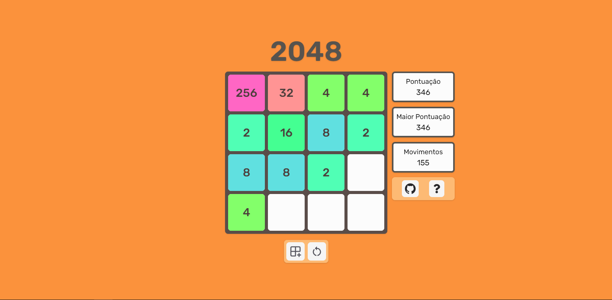
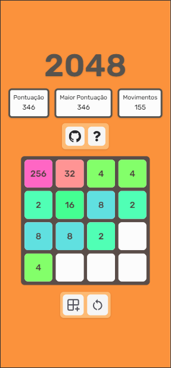

# 2048 Game

Welcome to the 2048 game repository! This project is a web-based implementation of the popular 2048 game, developed using TypeScript, React, and TailwindCSS.

> Available to play at [2048-orochaa.vercel.app](https://2048-orochaa.vercel.app/)

## Table of Contents

- [About the Game](#about-the-game)
- [Screenshots](#screenshots)
- [Lessons Learned](#lessons-learned)
- [Installation](#installation)
- [Usage](#usage)
- [Contributing](#contributing)
- [License](#license)

## About the Game

2048 is a single-player puzzle game created by Italian web developer Gabriele Cirulli. The objective of the game is to slide numbered tiles on a grid to combine them and create a tile with the number 2048. Players can continue to play and reach higher numbers after achieving the 2048 tile.

**Gameplay Instructions:**

- Use the arrow keys to move the tiles.
- When two tiles with the same number touch, they merge into one with a value equal to the sum of the two tiles.
- The game is won when a tile with the number 2048 is created.

## Screenshots

### Web



### Mobile



## Lessons Learned

During the development of this game, several key lessons were learned:

1. **State Management:** Managing the game state efficiently using React's state and hooks was crucial for performance and code clarity.
2. **TypeScript Integration:** Implementing TypeScript provided strong typing and improved code quality, making the development process smoother and less error-prone.
3. **Styling with TailwindCSS:** Utilizing TailwindCSS for styling allowed for rapid development and consistent design, reducing the need for custom CSS.
4. **Game Logic:** Developing the game logic for merging tiles and handling user input required careful planning and testing to ensure correctness and responsiveness.
5. **Responsive Design:** Ensuring the game was playable on various devices and screen sizes highlighted the importance of responsive design principles.
6. **Animation Management:** One of the most challenging aspects was handling the correct state management for start and finish animations without introducing bugs. This was crucial for the flow and joy of the game, as a seamless animation experience is essential for player engagement.

## Installation

To get started with the 2048 game, follow these steps:

1. **Clone the repository:**

   ```sh
   git clone https://github.com/orochaa/2048.git
   cd 2048
   ```

2. **Install dependencies:**

   ```sh
   npm install
   ```

3. **Start the development server:**
   ```sh
   npm run dev
   ```

## Usage

Once the development server is running, open your browser and navigate to `http://localhost:4000` to play the game.

## Contributing

Contributions are welcome! If you have any ideas, bug reports, or improvements, feel free to open an issue or submit a pull request.

## License

This project is licensed under the MIT License. See the [LICENSE](./LICENSE) file for details.
